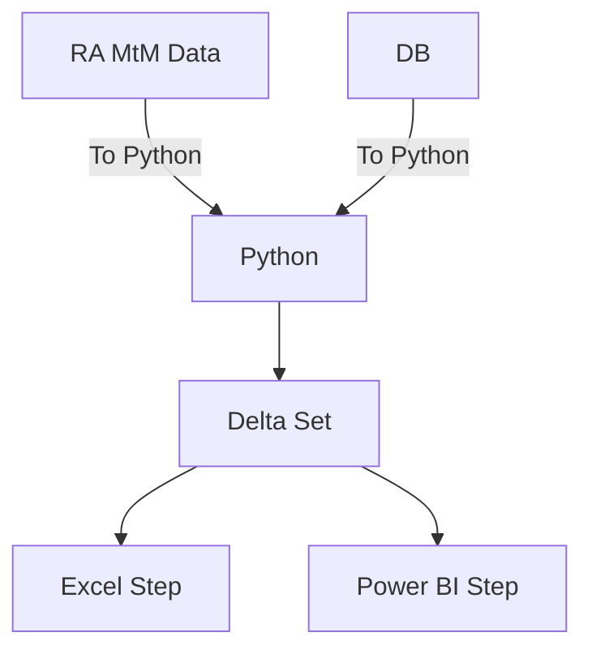

Test for S23 PnL user manual using github page

## MtM flow diagram

## Steps
1. Open RA, navigate to the mtm_ym_default_share_v2 report, if the report is not present, using the config file to load the report view.
2. Set the trade date to be less than the current business day
3. Right click and use the **Save Report** to save it under **"PnL\Core P&L\2024\test\mtm"**.
4. Open Jupyter Notebook, and select the **snapshot comparison.ipynb** file. Change d1_date= datetime(2024,10,18).date() to the files that matchs, Click on restart kernel and run all cells.
5. Open **S23 PnL test_Oct.xlsx** files, change the date in the input tab and refresh all queries. this will load the data which has been prepared by Python.
6. Billions and Billions of profit.

